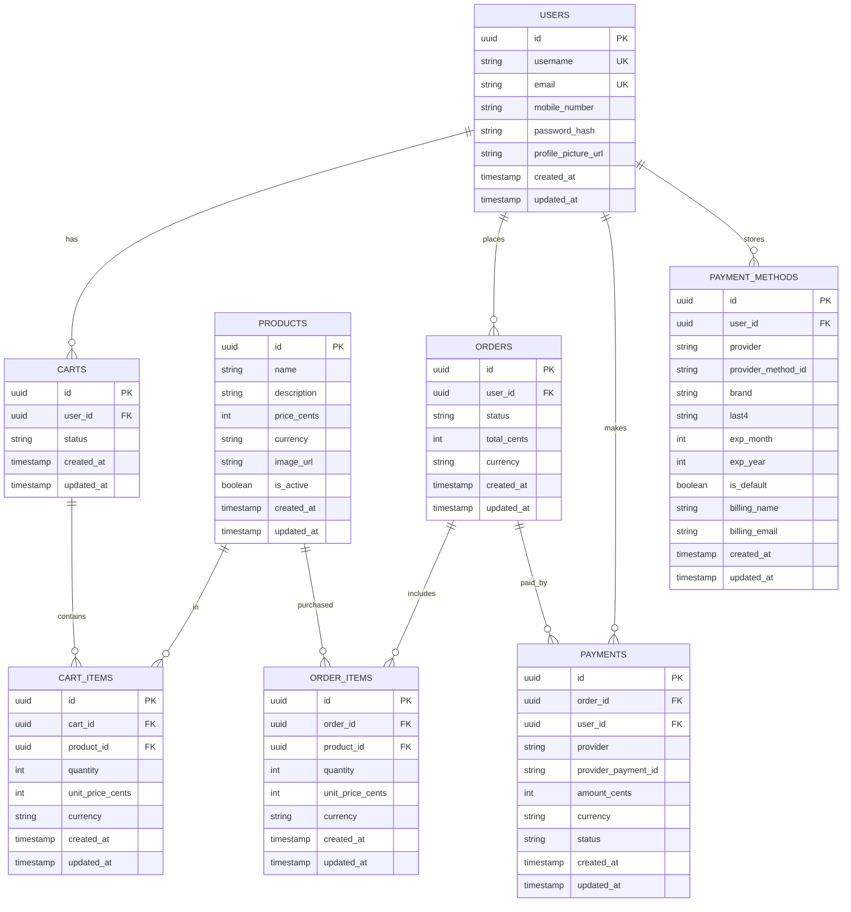

# E-commerce Database Schema (Preview)

This is a quick preview of the tables and relationships created by the Sequelize models.

## ER Diagram

## Notes

- **Passwords** are stored as `password_hash` (never store plain text passwords).
- **Payment details**: this schema stores provider IDs/tokens + non-sensitive metadata (brand/last4/expiry). Do **not** store full card numbers or CVV.
